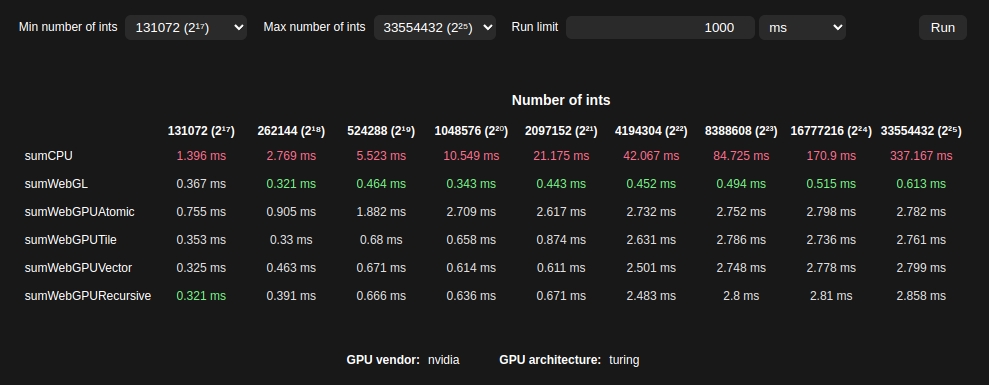
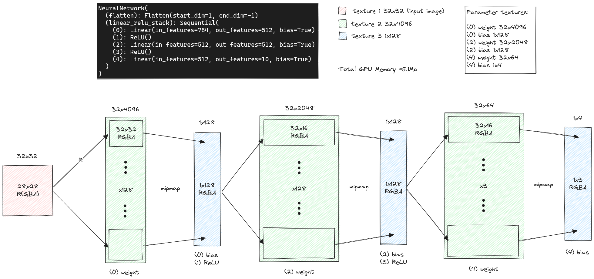

# ML Browser GPU

Various pre-trained machine learning models reimplemented to run on browsers through WebGL and WebGPU.

## Parallel sum reduction

Ok, this one isn't exactly an ML model but I wanted to experiment first with basic building blocks. This example consists in summing a large number of integers as quickly as possible.

It's quite interesting to note that WebGPU isn't necessarily faster when we can combine WebGL with mipmaps.

This example can be tested locally: http://localhost:5173/sum/.

The source code is available in the directory [src/sum](src/sum).

### Result



### References

- https://developer.download.nvidia.com/assets/cuda/files/reduction.pdf
- https://developer.nvidia.com/blog/cooperative-groups/
- https://siboehm.com/articles/22/CUDA-MMM

## PyTorch Quickstart Tutorial (WebGL)

To start simple, the model described in the [PyTorch Quickstart Tutorial](https://pytorch.org/tutorials/beginner/basics/quickstart_tutorial.html) has been implemented in WebGL.
You can see some details in [the notebook](fashion-mnist/notebooks/fashion-mnist.ipynb).

For now the source code is in [main.ts](src/main.ts)

Here is an overview of the WebGL design:



### Result

```
----------------------------------------------------------------------------------------------------
Output: -2.2995, -2.1135, -1.0424, -1.6524, -0.9015, 2.4404, -1.1452, 2.6658, 1.6956, 3.0893
Predicted: Ankle boot
Time: 14.699999999254942ms
----------------------------------------------------------------------------------------------------
Output: -2.2995, -2.1135, -1.0424, -1.6524, -0.9015, 2.4404, -1.1452, 2.6658, 1.6956, 3.0893
Predicted: Ankle boot
Time: 11.299999998882413ms
----------------------------------------------------------------------------------------------------
Output: -2.2995, -2.1135, -1.0424, -1.6524, -0.9015, 2.4404, -1.1452, 2.6658, 1.6956, 3.0893
Predicted: Ankle boot
Time: 1.099999999627471ms
----------------------------------------------------------------------------------------------------
Output: -2.2995, -2.1135, -1.0424, -1.6524, -0.9015, 2.4404, -1.1452, 2.6658, 1.6956, 3.0893
Predicted: Ankle boot
Time: 0.6999999992549419ms
----------------------------------------------------------------------------------------------------
Output: -2.2995, -2.1135, -1.0424, -1.6524, -0.9015, 2.4404, -1.1452, 2.6658, 1.6956, 3.0893
Predicted: Ankle boot
Time: 0.6999999992549419ms
----------------------------------------------------------------------------------------------------
```
