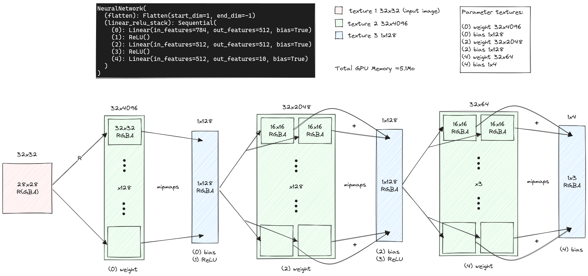

# ML Browser GPU

Various pre-trained machine learning models reimplemented to run on browsers through WebGL and WebGPU.

## PyTorch Quickstart Tutorial (WebGL)

To start simple, the model described in the [PyTorch Quickstart Tutorial](https://pytorch.org/tutorials/beginner/basics/quickstart_tutorial.html) has been implemented in WebGL.
You can see some details in [the notebook](notebooks/fashion-mnist.ipynb).

For now the source code is in [main.ts](src/main.ts)

Here is an overview of the WebGL design:



### Result

We can see that when the inference lasts longer, most of the time is spent reading the pixels, which are downloaded from the GPU to compute and log the end result.

#### Chrome

```
----------------------------------------------------------------------------------------------------
Output: -2.2995, -2.1135, -1.0424, -1.6524, -0.9015, 2.4404, -1.1452, 2.6658, 1.6956, 3.0893
Predicted: Ankle boot
GPU time: 0.8999999985098839ms
Total time: 14.699999999254942ms
----------------------------------------------------------------------------------------------------
Output: -2.2995, -2.1135, -1.0424, -1.6524, -0.9015, 2.4404, -1.1452, 2.6658, 1.6956, 3.0893
Predicted: Ankle boot
GPU time: 0.09999999962747097ms
Total time: 11.299999998882413ms
----------------------------------------------------------------------------------------------------
Output: -2.2995, -2.1135, -1.0424, -1.6524, -0.9015, 2.4404, -1.1452, 2.6658, 1.6956, 3.0893
Predicted: Ankle boot
GPU time: 0.30000000074505806ms
Total time: 1.099999999627471ms
----------------------------------------------------------------------------------------------------
Output: -2.2995, -2.1135, -1.0424, -1.6524, -0.9015, 2.4404, -1.1452, 2.6658, 1.6956, 3.0893
Predicted: Ankle boot
GPU time: 0.09999999962747097ms
Total time: 0.6999999992549419ms
----------------------------------------------------------------------------------------------------
Output: -2.2995, -2.1135, -1.0424, -1.6524, -0.9015, 2.4404, -1.1452, 2.6658, 1.6956, 3.0893
Predicted: Ankle boot
GPU time: 0.19999999925494194ms
Total time: 0.6999999992549419ms
----------------------------------------------------------------------------------------------------
```

#### Firefox

```
----------------------------------------------------------------------------------------------------
Output: -2.2995, -2.1135, -1.0424, -1.6524, -0.9015, 2.4404, -1.1452, 2.6658, 1.6956, 3.0893
Predicted: Ankle boot
GPU time: 0ms
Total time: 23ms
----------------------------------------------------------------------------------------------------
Output: -2.2995, -2.1135, -1.0424, -1.6524, -0.9015, 2.4404, -1.1452, 2.6658, 1.6956, 3.0893
Predicted: Ankle boot
GPU time: 1ms
Total time: 9ms
----------------------------------------------------------------------------------------------------
Output: -2.2995, -2.1135, -1.0424, -1.6524, -0.9015, 2.4404, -1.1452, 2.6658, 1.6956, 3.0893
Predicted: Ankle boot
GPU time: 0ms
Total time: 1ms
----------------------------------------------------------------------------------------------------
Output: -2.2995, -2.1135, -1.0424, -1.6524, -0.9015, 2.4404, -1.1452, 2.6658, 1.6956, 3.0893
Predicted: Ankle boot
GPU time: 0ms
Total time: 0ms
----------------------------------------------------------------------------------------------------
Output: -2.2995, -2.1135, -1.0424, -1.6524, -0.9015, 2.4404, -1.1452, 2.6658, 1.6956, 3.0893
Predicted: Ankle boot
GPU time: 1ms
Total time: 30ms
----------------------------------------------------------------------------------------------------
```
